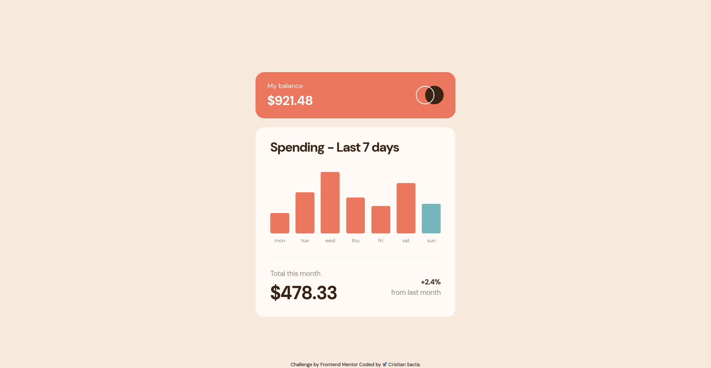

# Frontend Mentor - Expenses chart component solution

This is a solution to the [Expenses chart component challenge on Frontend Mentor](https://www.frontendmentor.io/challenges/expenses-chart-component-e7yJBUdjwt). Frontend Mentor challenges help you improve your coding skills by building realistic projects. 

## Table of contents

- [Overview](#overview)
  - [The challenge](#the-challenge)
  - [Screenshot](#screenshot)
  - [Links](#links)
- [My process](#my-process)
  - [Built with](#built-with)
  - [What I learned](#what-i-learned)
  - [Continued development](#continued-development)
- [Author](#author)
- [Acknowledgments](#acknowledgments)

## Overview

Hi friends, this project is very special for me, becouse my life is so complated right now but i clean my tears, be strong and go ahead. Please give a feedback, is very important for me.  

### The challenge

Users should be able to:

- View the bar chart and hover over the individual bars to see the correct amounts for each day
- See the current day’s bar highlighted in a different colour to the other bars
- View the optimal layout for the content depending on their device’s screen size
- See hover states for all interactive elements on the page
- **Bonus**: Use the JSON data file provided to dynamically size the bars on the chart

### Screenshot



### Links

- Solution URL: [Github.com](https://your-solution-url.com)
- Live Site URL: [Watch on Vercel.com](https://your-live-site-url.com)

## My process

### Built with

- Semantic HTML5 markup
- CSS custom properties
- Flexbox
- Mobile-first workflow
- [TailwindCss](https://tailwindcss.com/) - Tailwind
- Fetch functions in JavaScript

### What I learned

I learned more of fetch and time functions for javascript, too the absulute and relative positions specially in the tooltip elements 

Fetch for read json file 

```js
fetch("../data.json")
  .then(function (response) {
    return response.json();
  })
  .then(function (data) {
    maxValue = getMaxValue(data);
    data.forEach(element => {
        let idChar = 'char-' + element.day;
        char = document.getElementById(idChar)
        setHeightChar(element, char, maxValue);
        setBgChar(element, char);
        setAmountValue(element, char);
    });
  })

```

For tooltipp

```css
  .char-tooltip {
      @apply invisible md:text-[18px] md:font-bold md:w-[71px] text-center absolute md:-top-12 -top-8 m-auto md:h-[39px] md:-left-[0.6rem] left-0 right-0 rounded shadow p-1 bg-darkBrown text-cream;
  }

  .char-bar:hover .char-tooltip {
      @apply visible z-50;
  }
```

### Continued development

Practice more CssGrid and fetch functions

## Author

- Frontend Mentor - [@cristianoso19](https://www.frontendmentor.io/profile/cristianoso19)
- Twitter - [@cristianoso19](https://www.twitter.com/cristianoso19)

## Acknowledgments

Learn position absolute and relative and CssGrid
